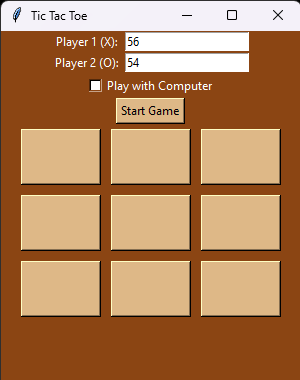
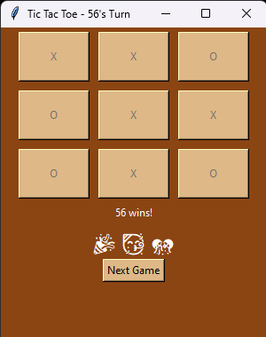

# Tic Tac Toe Game

**Author**: Muhammad Yousaf  
**Email**: yousafsahiwal3@gmail.com

## Overview

The Tic Tac Toe Game is a Python application that allows two players to play the classic game of Tic Tac Toe. It provides a graphical user interface using the Tkinter library. Players can enter their names and choose to play with a friend or against the computer. The game features a wood-themed design and includes sound effects and win animations.

## Features

- Two-player mode: Players can enter their names and play against each other.
- Play with the computer: Players can choose to play against the computer.
- Wood-themed GUI: The game has a wood-themed graphical user interface.
- Sound effects: Clicking on buttons produces sound effects.
- Win animations: When a player wins, celebratory animations are displayed.
- Next game button: After a game ends, players can start a new game by clicking the "Next Game" button.

## Requirements

- Python 3.x
- Tkinter
- Winsound (for Windows users)

## Installation

1. Ensure you have Python installed on your system.
2. Run the following command to install the required libraries:
    ```sh
    pip install tk
    ```

## Usage

1. Save the provided code in a file named `tictactoe.py`.
2. Run the script using Python:
    ```sh
    python tictactoe.py
    ```
3. Enter the names of Player 1 (X) and Player 2 (O) in the input fields.
4. Check the "Play with Computer" option if you want to play against the computer.
5. Click the "Start Game" button to begin.
6. Click on the buttons to place X or O on the board.
7. If playing against the computer, wait for the computer's move.
8. Continue playing until someone wins or the game ends in a draw.
9. After a game ends, click the "Next Game" button to start a new game.

## Code Explanation

### Main Functions

- `create_widgets`: This function creates the graphical user interface using Tkinter. It includes input fields for player names, a checkbox to play with the computer, and buttons to start the game and make moves.
- `start_game`: This function retrieves the player names and whether to play with the computer from the GUI and starts the game accordingly.
- `play`: This function handles player moves and computer moves (if playing against the computer). It checks for a winner or a draw after each move.
- `computer_play`: This function generates the computer's move if playing against the computer.
- `switch_player`: This function switches the current player after each move.
- `check_winner`: This function checks if there is a winner after each move.
- `is_board_full`: This function checks if the board is full, indicating a draw.

### GUI Setup

The GUI is created using Tkinter. Entry widgets are used to input player names, and a checkbox is used to select whether to play with the computer. Buttons are used to start the game and make moves.

## Example

After filling in the player names and starting the game, the Tic Tac Toe board will be displayed on the screen. Here's a screenshot of the game in action:




## License

This project is open-source and available under the MIT License.

---

Feel free to reach out to the author via email at yousafsahiwal3@gmail.com for any queries or further assistance.
